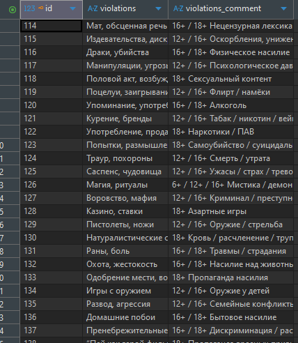
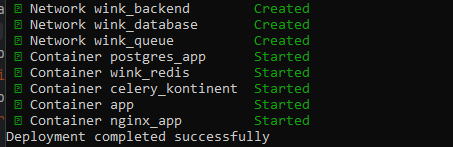
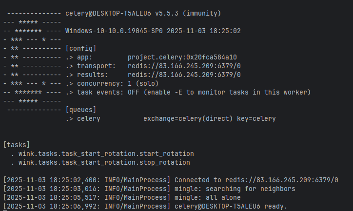

## Commands

```
py manage.py createsuperuser # - Создать пользователя
py manage.py makemigrations # - Создать миграции для новых можелей db
py manage.py migrate        # - Применить миграции к db
py manage.py showmigrations # - Вывести список миграций
py manage.py migrate <app_name> zero # - Откатиться до определенной миграции
py manage.py migrate <app_name> <migration name> # - Отменить все миграции
py manage.py collectstatic
py manage.py runserver
py manage.py delete_all_superusers # -  удалить всех польхователей из db - "wink/management/commands/delete_all_superusers.py"
py manage.py load_violations # - загрузть файл excel - "wink/management/commands/load_violations.py". См. Законы РФ (ниже)
daphne project.asgi:application # - mode: develop & poduction
git clone <url_repo.git > # - Клонировать репозиторий 
git log --all --oneline --graph --decorate --date=format:'%Y-%m-%d %H:%M:%S' --pretty=format:'%C(yellow)%h%C(auto)%d %C(white)%cd%Creset %s' # - история развития проекта

```

### Note:
"`py manage.py collectstatic --clear --noinput`" Запускать после каждого измения статик файлов.
*"`--clear`"* - удаляет старые файлы. *"`--noinput`"* - если не хотите время тратить на комментарии после запуска команды. \
- "`makemigrations`" создать файлы миграции в db;
- "`migrate`" - изменить структуру базы данных;
- "`runserver`" - запускаем локальный сервер "`daphne`" для разработки.   

----

### *.sh файл для сервера
Создаем дополнительные базы данных в которых нааша app будет создавать свои таблицы/migrate

```init-databases.sh
#!/bin/bash
set -e

echo "Waiting for PostgreSQL to become ready..."

# Ждем пока PostgreSQL будет готов
until pg_isready -U "$POSTGRES_USER" -d "$POSTGRES_DB"; do
  echo "PostgreSQL is unavailable - sleeping"
  sleep 1
done

echo "PostgreSQL is ready!"

# Создаем дополнительные базы данных
if [ -n "$POSTGRES_MULTIPLE_DATABASES" ]; then
  echo "Creating multiple databases: $POSTGRES_MULTIPLE_DATABASES"

  for db in $(echo $POSTGRES_MULTIPLE_DATABASES | tr ',' ' '); do
    # Убираем возможные пробелы
    db_clean=$(echo $db | tr -d ' ')

    if [ -n "$db_clean" ]; then
      echo "Creating database: $db_clean"

      # Создаем базу данных
      psql -v ON_ERROR_STOP=1 --username "$POSTGRES_USER" <<-EOSQL
        CREATE DATABASE "$db_clean";
        GRANT ALL PRIVILEGES ON DATABASE "$db_clean" TO "$POSTGRES_USER";
EOSQL

      echo "Database $db_clean created successfully"
    fi
  done
fi

echo "All databases created successfully!"

```

---
## URL 
### Локальный
* "`admin/`"; Старая версия
* "`cms/`"; Новая версия
* "`swagger/`" API;
* "`redoc/`" API - возможно скачать для Postman;
* "`swagger<format>/`".


## Админ-панель от Django
### Admin
 _В процессе._


### 
## Дерево проекта

```text
WINK
├──.git/
├──.github/
│       └──workflows/*
│           └──*.yml
├──bundles/
│   └──webpack-stats.json	
├──collectstatic/
├──media/
│   ├──upload/ 
│   └──classification_events.xlsx
├──wink/
│   ├──/management
│   │   └──commands/
│   │      └──*.py
│   ├──wink_api/
│   │   ├──commands/
│   │   │   ├──files/
│   │   │   │   └──*.py
│   │   │   ├──violations/
│   │   │   │   └──*.py
│   │   │   └──*.py
│   │   └──*.py
│   ├──migrations/
│   │   └──*.py 
│   ├──models_wink/
│   │   └──*.py
│   ├──tasks/
│   │   └──*.py 
│   └──*.py
├──img/
│   └──*.png
├──nginx/
│   ├──.dockerignore
│   ├──default.conf
│   └──Dockerfile
├──project/
│   └──*.py
├──static/
│   ├──scripts/
│   |   └──*.js
│   └──styles/
│       └──*.css
├──templates/
|   └──*.html
├──.browserslistrc
├──.dockerignore
├──.editorconfig
├──.env
├──.flake8
├──.gitignore
├──swagger.json
├──.pre-commit-config.yaml
├──.pylintrc
├──docker-compose.yml
├──Dockerfile
├──logs.py
├──manage.py
├──pyproject.toml
├──pytest.ini
├──README.md
├──requirements.txt
```

---

## .ENV
```text
PYTHONPATH=E:\pas\to\your\project\root
SECRET_KEY_DJ= < secret_key_your_django >
DJANGO_SETTINGS_MODULE=project.settings


# app
APP_PROTOCOL=http
APP_HOST=127.0.0.1
APP_HOST_REMOTE= < host_from_remote_server >
APP_PORT=8000
APP_TIME_ZONE=Asia/Krasnoyarsk

# db
POSTGRES_MULTIPLE_DATABASES=< база данных с которой работает app>
POSTGRES_DB= < db_name> # Имя основной базы данный 
POSTGRES_USER= < user_name_for_db>
POSTGRES_HOST=< host_for_db >


POSTGRES_PORT=< port_db_>
POSTGRES_PASSWORD= < password_from_db >
DB_ENGINE=django.db.backends.postgresql

DATABASE_ENGINE_LOCAL=django.db.backends.sqlite3
DATABASE_LOCAL=wink_db.sqlite3

JWT_ACCESS_TOKEN_LIFETIME_MINUTES=5
JWT_REFFRESH_TOKEN_LIFETIME_DAYS=10
```
----

|                      |                               |                           |
|:---------------------|:------------------------------|:--------------------------|
| async "`Django`"           |      "`wagtail`"                | "`PostgreSQL` or "`ASQLite`" |
| "`daphne`"           |         "`channels`"            |     "`djangorestframework`"            |
| [swagger](./swagger) | [nginx](./nginx/default.conf) |[docker-compose](./docker-compose.yml)   |
| "`asincio`"              | "`adrf`" | "`psycopg2`"|
|"`channels[daphne]`"|"`celery[redis]`"|"`redis`"|
|"`pandas`"|||
----

## Permissions
API логика проекта работает только с авторизированным пользователем, без учёта его роли.\
JWT-токен не рассматривается в логике.\
Заглушка, когда через `docker-compose` регистрируется пользователь\
```text
python3 ./manage.py shell -c "
    from django.contrib.auth import get_user_model
    User = get_user_model()
    if not User.objects.filter(username='root').exists():
        User.objects.create_superuser('root', 'admin@example.com', '123')
        print('Superuser root created successfully')
    else:
        print('Superuser root already exists')
    "
```
Далее, на сервер все запросы поступают ("`wink.middleware.AuthenticationMiddleware`") от  пользователя "`root`".

----
## Законы РФ
Запуская проект, базовый список из "`excel`"файла вноситься в DB автомматически. Используется команда "`load_violations`" (самописная).\
Из панели администратора список редактируется.\
Файл для базовой загрузки: "`media/classification_events.xlsx`".\
Модель: "`wink.models_wink.violations.BasisViolation`".\
Цель: Иеть возможность статичных наименований нарушений, для классификации этих нарушений в сценарии.\ 
Отдельные модели имеют дополнительные поле для сохранения количества нарушений.


### Note:
Команда "`load_violations`" не рассматривалась для выполнения такой задачи, как загрузка файла в уже действующию базу.\
Данная модель только придусматривает возможность расширения возможностей app. Чтоб AI подтягивал виды нарушений и работал с ними в момент анализа сценария.



----
## Docker-compose


---
## Celery
"`celery -A project.celery worker --loglevel=info --pool=solo`"



### Celery tasks
[wink/tasks/task_start_rotation::start_rotation](https://github.com/Tryd0g0lik/cinema_category/blob/ec2e32459e8de85377e50ee9fe30ee3a7783d385/wink/tasks/task_start_rotation.py#L52)

Контролер за:
- количеством обращений к файлу от разных польхователей.
- времени работы с реферальной/refer ссылкой.

Идея такова
- refer обновляется каждые 90 секунд;
- Максимальное время работы ключа 10 минут;
- один файл могут парсить максимум/лимит 10 пользователей. Это к вопросу , что есть разные роли и все они могут интересоваться сюжетом;
- изначально создаётся (и запускается цикл обновлений) при первичном сохранении файла на диске;
- цикл обновлений останавливается при попытке скачивания файла по 'refer' ключу.\
**Note**: Повторно запустить логику для 'refer' (создать ключ ) - не создано.

### Note:
НЕ тестировалось ("`start_rotation`" )!! 


Затем рефер объеденяет - файл и комментарии
